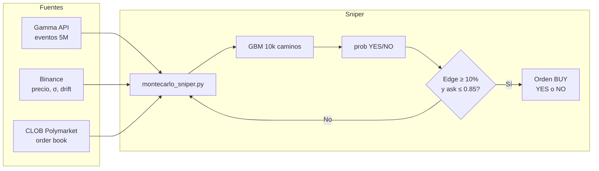
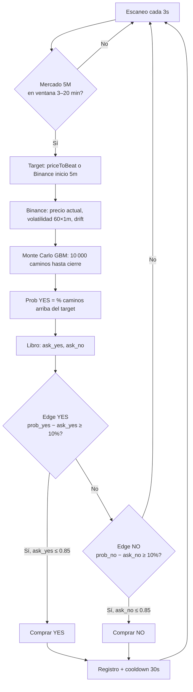
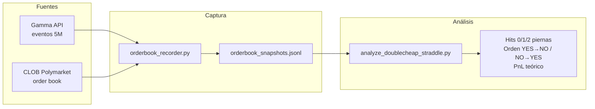
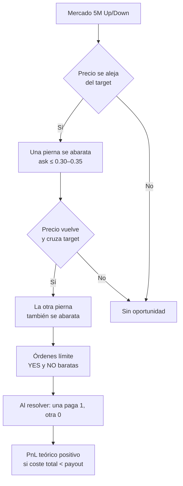
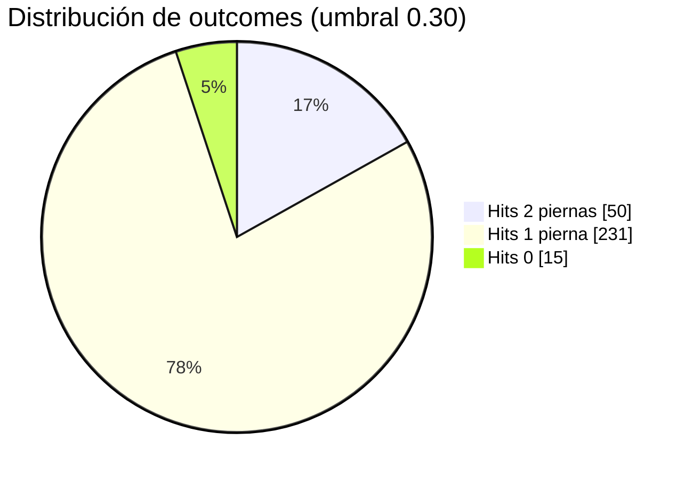

<div align="center">
  

  # 🎯 PumaClaw: Monte Carlo Sniper
  **Autonomous Quantitative Trading for Polymarket (Polygon)**

  <p align="center">
    <i>The bridge between crowd sentiment and mathematical reality.</i>
    <br>
    <b>Strategy:</b> Geometric Brownian Motion · <b>Markets:</b> BTC/ETH 5‑min · <b>Max bet:</b> $10 USD
  </p>
</div>

---

## 🚀 Quick Start

1. **Clona el repo** y crea un entorno virtual:
   ```bash
   git clone https://github.com/MarxMad/Polymarkets_Agents.git
   cd Polimarkets_Bots
   python3 -m venv .venv && source .venv/bin/activate  # o `venv\Scripts\activate` en Windows
   pip install -r polymarket-trading/requirements.txt
   ```

2. **Configura tus API keys** (ver sección [Configuración: API Keys](#-configuración-api-keys)).

3. **Ejecuta el sniper** (recomendado en un servidor 24/7):
   ```bash
   cd polymarket-trading/scripts
   python3 montecarlo_sniper.py
   ```

4. **Abre el dashboard** para ver la simulación en vivo:
   ```bash
   ./abrir_dashboard.sh   # desde la raíz del repo (túnel SSH + cortex en AWS)
   # o local: python3 polymarket-trading/scripts/montecarlo_cortex.py
   ```
   Luego visita **http://localhost:8050**.

---

## 🎯 Estrategia en producción: Monte Carlo Sniper

**Nombre oficial:** **Monte Carlo Sniper**

Estrategia cuantitativa que opera en mercados binarios 5M de BTC/ETH en Polymarket. Usa **simulación Monte Carlo (GBM)** para estimar la probabilidad real de que el precio quede por encima del target al cierre; si esa probabilidad supera al precio del libro en un **edge** mínimo, el bot compra **una sola pierna** (YES o NO) por señal.

| Aspecto | Detalle |
|--------|---------|
| **Mercados** | Binarios 5M (tag 102892), BTC y ETH |
| **Resolución** | Cierre de vela 1m en Binance (BTCUSDT/ETHUSDT) |
| **Script** | `polymarket-trading/scripts/montecarlo_sniper.py` |
| **Dashboard** | `polymarket-trading/scripts/montecarlo_cortex.py` (puerto 8050) |
| **Tamaño** | Máx. 1 USD y 2 shares por operación (configurable) |

**Flujo resumido:** Gamma API (mercados activos) → Binance (precio, volatilidad, drift) → Monte Carlo GBM (10k caminos) → probabilidad YES/NO → comparación con ask del libro → si hay edge, una orden de compra → registro en `trades_history.json` y cooldown.

**Pipeline de datos:**



**Lógica de la estrategia:**



Documentación completa (parámetros, flujo, viabilidad): **[docs/ESTRATEGIA_MONTECARLO_SNIPER.md](docs/ESTRATEGIA_MONTECARLO_SNIPER.md)** · [Análisis de viabilidad](docs/VIABILIDAD_ESTRATEGIA_MONTECARLO.md).

---

## 🔑 Configuración: API Keys

El bot **nunca** incluye claves en el código. Todas se leen desde variables de entorno. La forma recomendada es un archivo **`.env`** que no se sube a git.

### Dónde poner las claves

- **En tu máquina o servidor:** crea el archivo  
  `~/.openclaw/.env`  
  (o, si usas otra ruta, configura `load_dotenv()` en el script para que apunte a ese archivo).

- **Contenido mínimo** (una línea por variable, sin comillas alrededor del valor):

```bash
# Polymarket CLOB (obligatorio para operar)
POLYMARKET_PRIVATE_KEY=0x...tu_clave_privada_de_la_wallet...
POLYMARKET_API_KEY=tu_api_key
POLYMARKET_API_SECRET=tu_api_secret
POLYMARKET_API_PASSPHRASE=tu_passphrase

# Wallet que firma y paga (proxy/safe en Polygon)
PROXY_ADDRESS=0x...dirección_de_tu_proxy...

# Telegram (opcional, para notificaciones de trades)
TELEGRAM_BOT_TOKEN=123456:ABC...
TELEGRAM_CHAT_ID=123456789
```

### Cómo obtener las credenciales de Polymarket

1. **Wallet (Polygon):** necesitas una wallet en Polygon (MetaMask, etc.) con USDC para apostar. La **private key** de esa wallet (o de un proxy/safe que la use) es `POLYMARKET_PRIVATE_KEY`. **Nunca compartas ni subas esta clave.**

2. **API de Polymarket:** entra en [Polymarket](https://polymarket.com) → perfil / configuración → **API** (o [CLOB API](https://docs.polymarket.com/#creating-an-api-key)). Crea una API key; te darán:
   - `POLYMARKET_API_KEY`
   - `POLYMARKET_API_SECRET`
   - `POLYMARKET_API_PASSPHRASE`

3. **PROXY_ADDRESS:** es la dirección de la wallet (o proxy) que envía las órdenes y tiene el USDC. Suele ser la misma wallet cuya private key usas, o la dirección del “funder” que configures en el CLOB.

4. **Telegram:** crea un bot con [@BotFather](https://t.me/BotFather), anota el token. Para el chat id, escribe a tu bot y visita `https://api.telegram.org/bot<TOKEN>/getUpdates`; ahí verás el `chat.id`.

### Comprobar que todo carga

```bash
cd polymarket-trading/scripts
python3 -c "
from dotenv import load_dotenv
import os
load_dotenv(os.path.expanduser('~/.openclaw/.env'))
for k in ['POLYMARKET_PRIVATE_KEY','POLYMARKET_API_KEY','PROXY_ADDRESS']:
    v = os.getenv(k)
    print(k, ':', 'OK (hidden)' if v else 'FALTA')
"
```

Si algo falta, revisa la ruta del `.env` y que no haya espacios de más en las variables.

---

## ⚙️ Cómo funciona el bot

El **Monte Carlo Sniper** opera en mercados binarios de Polymarket del tipo *“¿Precio de BTC/ETH por encima de X a la hora T?”* (mercados 5M). Resolución según **Binance** (cierre de vela 1m). Flujo resumido:

```
1. Escaneo   → Gamma API: mercados activos que cierran en 7–20 min (BTC/ETH).
2. Datos     → Binance: precio actual, volatilidad y drift (últimas 60 velas 1m).
3. Simulación → Monte Carlo (GBM): 10 000 caminos de precio hasta la hora de cierre.
4. Probabilidad → % de caminos que terminan por encima del “price to beat” = prob. real YES.
5. Edge      → Comparación con el libro de Polymarket: si prob_real - ask_yes > 7% → hay edge.
6. Ejecución → Compra de YES o NO (máx. 10 USD por operación, tope 10 shares).
7. Registro  → trades_history.json + traded_markets (evitar doble orden).
```

- **Una sola instancia:** el script usa un lock file (`.sniper.lock`) para que solo corra un proceso.
- **Un trade por señal:** tras enviar una orden hay cooldown y no se repite el mismo mercado.
- **Máximo 10 USD y 10 shares** por operación para controlar riesgo (valores actuales en código: 1 USD, 2 shares).

Para nombre oficial, parámetros y ficha completa de la estrategia, ver la sección [Estrategia en producción: Monte Carlo Sniper](#-estrategia-en-producción-monte-carlo-sniper) más arriba y [docs/ESTRATEGIA_MONTECARLO_SNIPER.md](docs/ESTRATEGIA_MONTECARLO_SNIPER.md).

---

## 📚 Investigación y documentación

El proyecto incluye documentación técnica y simulaciones para evaluar viabilidad y estrategias alternativas. Índice completo en **[docs/README.md](docs/README.md)**.

| Documento | Contenido |
|-----------|------------|
| [docs/ESTRATEGIA_MONTECARLO_SNIPER.md](docs/ESTRATEGIA_MONTECARLO_SNIPER.md) | **Ficha de la estrategia en producción:** Monte Carlo Sniper (nombre, flujo, parámetros, auditoría). |
| [docs/VIABILIDAD_ESTRATEGIA_MONTECARLO.md](docs/VIABILIDAD_ESTRATEGIA_MONTECARLO.md) | Viabilidad del Monte Carlo Sniper (GBM, edge, riesgo). |
| [docs/ANALISIS_HISTORIAL_TRADES.md](docs/ANALISIS_HISTORIAL_TRADES.md) | Análisis del historial de trades del sniper. |
| [docs/SIMULACION_DOUBLE_CHEAP_STRADDLE.md](docs/SIMULACION_DOUBLE_CHEAP_STRADDLE.md) | Simulación con datos reales del orderbook: estrategia "double-cheap straddle" (YES y NO baratos), captura de snapshots, análisis por umbral 0.30–0.35 y resultados. |

Scripts asociados a la simulación 2: `orderbook_recorder.py` (graba orderbook en JSONL), `analyze_doublecheap_straddle.py` (analiza hits y PnL teórico). Ver el doc para variables de entorno y cómo ejecutar.

### Simulación 2: Double-Cheap Straddle (datos reales)

Estrategia alternativa: comprar **YES y NO** cuando cada uno cotice por debajo de un umbral (ej. 0.30–0.35). Al resolver, una pierna paga 1 USD/share y la otra 0; si ambas se compraron barato, el PnL teórico es positivo. Todo se mide con **snapshots reales del orderbook** del CLOB.

**Pipeline de datos:**



**Lógica de la estrategia:**



**Última corrida (datos reales):** 222.641 snapshots · 296 markets únicos.

| Umbral | Hits 2 piernas | Frecuencia | Orden YES→NO / NO→YES | PnL medio (2 piernas) |
|--------|-----------------|------------|------------------------|------------------------|
| **0.30** | 50 | 16.9% | 24 / 26 | **+1.74 USD** |
| 0.31 | 54 | 18.2% | 25 / 29 | +1.67 USD |
| 0.32 | 61 | 20.6% | 27 / 34 | +1.51 USD |
| 0.33 | 65 | 22.0% | 31 / 34 | +1.38 USD |
| 0.34 | 70 | 23.6% | 31 / 39 | +1.26 USD |
| **0.35** | 78 | **26.4%** | 35 / 43 | +1.16 USD |



Documentación completa: [docs/SIMULACION_DOUBLE_CHEAP_STRADDLE.md](docs/SIMULACION_DOUBLE_CHEAP_STRADDLE.md).

---

## 🧭 Visión general

**PumaClaw** es un sistema de trading cuantitativo para Polymarket. La idea central: los mercados de predicción suelen cotizar según sentimiento; una simulación Monte Carlo (GBM) estima una probabilidad “real” y se opera cuando hay **edge** frente al libro (p. ej. el mercado paga 40¢ y el modelo da 55% de prob. → compramos YES).

El sistema se centra en **mercados binarios cortos de cripto (5–15 min)**, con rotación alta y gestión de riesgo por operación (Kelly fraccional, tope por trade).

---

## 🎲 Simulación Monte Carlo (GBM)

Se usa **Movimiento Browniano Geométrico** para simular muchos futuros posibles del precio:

- **Volatilidad (σ):** de las últimas 60 velas 1m en Binance.
- **Drift (μ):** inercia direccional del activo.
- **Shock aleatorio:** en cada paso se añade ruido gaussiano.

Fórmula (discreta):  
$S_{t+1} = S_t \exp\left[\left(\mu - \frac{\sigma^2}{2}\right)dt + \sigma \sqrt{dt}\, W_t\right]$

El bot cuenta cuántos caminos terminan por encima del “price to beat” y convierte eso en probabilidad YES/NO para comparar con el libro.

---

## 💻 Dashboard en vivo

El **dashboard** (`montecarlo_cortex.py`) muestra en tiempo real:

- **Enjambre de caminos:** líneas verdes (precio por encima del target al cierre) y rojas (por debajo).
- **Línea target:** precio a batir para que gane YES.
- **Distribución** de precios al vencimiento (histograma) y probabilidad YES.
- **Balance** (USDC + posiciones) y log de señales.

Para usarlo en la nube (recomendado): `./abrir_dashboard.sh` desde la raíz del repo (túnel SSH a tu instancia y cortex en AWS). Luego **http://localhost:8050**.

---

## 🔒 Despliegue en servidor (24/7)

Recomendado: correr el sniper en una instancia (p. ej. AWS EC2) y no en una PC personal, para no exponer claves y mantener uptime.

### Sincronizar código

```bash
rsync -avz -e "ssh -i /ruta/a/tu.pem -o StrictHostKeyChecking=no" \
  polymarket-trading/ ubuntu@TU_HOST:~/.openclaw/workspace/skills/polymarket/
```

### Arrancar el sniper como servicio (systemd)

Incluido en el repo: `polymarket-trading/pumaclaw-sniper.service`. Script de deploy:

```bash
./scripts/deploy_and_start_sniper.sh
```

Eso instala el servicio de usuario, arranca el sniper y deja un solo proceso (lock + systemd). Ver logs: `tail -f ~/sniper_v5.log` en el servidor.

### Dashboard por túnel SSH

En tu máquina local:

```bash
ssh -i /ruta/a/tu.pem -L 8050:localhost:8050 ubuntu@TU_HOST
```

En el servidor, si el cortex no está ya corriendo:

```bash
cd ~/.openclaw/workspace/skills/polymarket && .venv/bin/python3 scripts/montecarlo_cortex.py
```

Abre **http://localhost:8050** en el navegador.

---

## 📁 Estructura del repo

```text
polymarket-trading/
├── SKILL.md                           ← Comandos OpenClaw
├── scripts/
│   ├── montecarlo_sniper.py           ← [CORE] Bot Monte Carlo (opera en 5M)
│   ├── montecarlo_cortex.py           ← [DASH] Dashboard en vivo
│   ├── montecarlo_viz.py              ← [LEGACY] Viz alternativo
│   ├── orderbook_recorder.py          ← [RESEARCH] Graba snapshots del orderbook (JSONL)
│   ├── analyze_doublecheap_straddle.py← [RESEARCH] Análisis double-cheap straddle
│   ├── trader.py                     ← Agente LLM
│   ├── contrarian_scalper.py         ← Scalper contrarian
│   ├── blind_sniper.py               ← Sniper ciego
│   └── liquidate_*.py                ← Redenciones / panic
├── pumaclaw-sniper.service            ← Servicio systemd sniper
├── pumaclaw-orderbook-recorder.service← Servicio systemd recorder (investigación)
├── pumaclaw-*.service                ← Otros daemons
└── strategy.json                     ← Parámetros

scripts/
├── deploy_and_start_sniper.sh        ← Deploy + arranque del sniper en EC2

docs/
├── README.md                         ← Índice de documentación e investigación
├── ESTRATEGIA_MONTECARLO_SNIPER.md   ← Ficha estrategia en producción (Monte Carlo Sniper)
├── VIABILIDAD_ESTRATEGIA_MONTECARLO.md   ← Viabilidad Monte Carlo Sniper
├── ANALISIS_HISTORIAL_TRADES.md      ← Análisis historial de trades
└── SIMULACION_DOUBLE_CHEAP_STRADDLE.md   ← Simulación 2: double-cheap straddle (datos reales)
```

---

## 🔐 Seguridad

- **Nunca** subas `.env`, `*.pem` ni archivos con claves al repositorio. El proyecto usa `.gitignore` para excluirlos.
- Todas las credenciales se leen con `os.getenv()` desde el entorno (típicamente desde `~/.openclaw/.env` en el servidor).
- En el código solo aparecen direcciones públicas (contratos, proxy por defecto); ninguna private key ni API secret.

---

## 📄 Licencia y uso

Código para uso educativo y de investigación. El trading conlleva riesgo; el rendimiento pasado no garantiza resultados futuros. Usa bajo tu propia responsabilidad.
