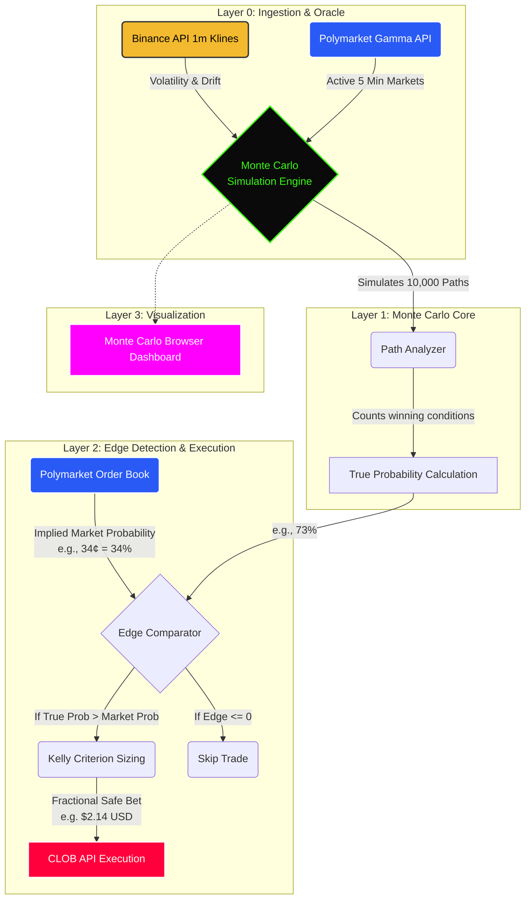

<div align="center">
  
  
  # 🎯 PumaClaw: Monte Carlo Sniper
  **Autonomous Agentic Trading Environment for Polymarket (Polygon)**
  
  <p align="center">
    <i>The bridge between crowd sentiment and absolute mathematical reality.</i>
    <br>
    <b>Capital Initial:</b> $50 USD &nbsp;&nbsp;|&nbsp;&nbsp; <b>Target:</b> $1,000,000 USD
  </p>
</div>

---

## 🧭 Visión General

Este repositorio contiene la arquitectura operativa y código fuente de **PumaClaw**, un sistema de agentes autónomos (*OpenClaw*) enfocado en ejecutar estrategias cuantitativas de alta frecuencia en el mercado de predicciones de Polymarket.

La tesis principal de este fondo algorítmico es que los mercados de predicción cotizan utilizando "sensaciones" y pánico (*crowd sentiment*), no matemáticas. Cuando las masas dicen que algo tiene un 18% de probabilidad, pero una simulación matemática demuestra que hay un 73%, se crea un modelo de "dinero asegurado" a largo plazo.

El sistema se enfoca en **Mercados Binarios Cortos en Criptomoneda (5 a 15 min)**, permitiendo una rotación de capital intensa y el modelo de Interés Compuesto.

---

## 🎲 ¿Qué es la Simulación Monte Carlo?

La Simulación Monte Carlo (llamada así por los casinos de Mónaco) es una técnica matemática robusta utilizada masivamente por fondos de cobertura (*Hedge Funds*) en Wall Street para modelar la probabilidad de que ocurran distintos resultados en un proceso complejo e impredecible (como el precio de Bitcoin).

En vez de tratar de adivinar un único futuro usando un LLM (ChatGPT) o análisis técnico básico, **Montecarlo acepta que el futuro es incierto, y dibuja decenas de miles de futuros paralelos basados en variables de la realidad.**

### La Fórmula: Geometric Brownian Motion (GBM)
El bot de PumaClaw usa una variante específica llamada Movimiento Browniano Geométrico para predecir precios. Sus ingredientes clave son:
1. **Volatilidad Verdadera ($\sigma$):** Observa cuán caótico está el mercado en las últimas 60 velas en Binance.
2. **Drift ($\mu$):** La inercia direccional o sesgo del activo.
3. **El Factor de Shock Aleatorio ($W_t$):** En cada segundo de simulación, la fórmula inyecta caos puramente aleatorio o "cisnes negros".

<div align="center">
  $S_{t+1} = S_t \exp\left[\left(\mu - \frac{\sigma^2}{2}\right)dt + \sigma \sqrt{dt} W_t\right]$
</div>

---

## ⚙️ Arquitectura del Bot (Flujo de Trabajo)

La siguiente arquitectura de sistemas (`mermaid`) explica cómo el ecosistema de **PumaClaw** pasa de recopilar métricas en vivo, a procesar la simulación matemática, y cómo esto culmina en una inyección de capital fraccional en la blockchain (Polymarket CLOB).



---

## 💻 El Dashboard en Vivo (`montecarlo_viz.py`)

Debido a que el bot corre ciegamente por debajo en la terminal, construimos un Dashboard usando `Dash` y `Plotly` de Python que se recarga cada dos segundos en tu navegador web.

Este panel intercepta el hilo matriz de Monte Carlo y renderiza visualmente:
- Un enjambre con cientos de proyecciones lineales que predicen hacia dónde se dirige el precio.
- Líneas **Verdes** (aquellas simulaciones que sobrepasan el Target Price para que gane la opción "YES").
- Líneas **Rojas** (aquellas donde la volatilidad arrastra el precio bajo el objetivo).

Esto te permite ver en tiempo real cómo el bot toma las decisiones basándose estricta y visualmente en la teoría de los grandes números.

---

## 🔒 Despliegue en Servidor

**Seguridad 100% aislada:**
Nunca corremos los scripts localmente en una PC personal para no comprometer llaves probadas ni arriesgar cortes de luz o inestabilidad. Todo el código de esta carpeta se empuja y sincroniza a una Instancia EC2 de AWS.

### 1. Sincronización de Archivos
Utiliza `rsync` para empujar el código desde tu repositorio local al servidor:
```bash
rsync -avz -e "ssh -i ~/Documents/AWS/PassPuma.pem -o StrictHostKeyChecking=no" polymarket-trading/ ubuntu@ec2-x-x-x-x.compute.amazonaws.com:~/.openclaw/workspace/skills/polymarket/
```

*(La bandera `StrictHostKeyChecking=no` evita bloqueos de huella SSH)*

### 2. Conectando al Dashboard en Modo Seguro
Ya que el Visualizador Dashboard también está montado en la nube (AWS), pero el servidor no tiene puertos web abiertos por seguridad de red, usamos un **Túnel SSH**. 

Desde tu máquina local crea el túnel:
```bash
ssh -i ~/Documents/AWS/PassPuma.pem -L 8050:localhost:8050 ubuntu@ec2-x-x-x-x.compute.amazonaws.com
```

Dentro del servidor, arranca el proceso del dashboard:
```bash
cd ~/.openclaw/workspace/skills/polymarket/
~/.venv/bin/python3 scripts/montecarlo_viz.py
```

Luego, simplemente abre tu navegador local en la Mac e ingresa a `http://localhost:8050`. ¡Estarás viendo el cálculo matemático en crudo directo desde la EC2!

---

## 📁 Estructura del Skills/Polymarket

```text
polymarket-trading/
├── SKILL.md                 ← Documentación de comandos para OpenClaw
├── scripts/
│   ├── montecarlo_sniper.py ← [MAIN] Cuantitativo Montecarlo 
│   ├── montecarlo_viz.py    ← [VISUAL] Dashboard Plotly/Dash Server
│   ├── trader.py            ← [DEP] Agente Textual Lento LLM
│   ├── contrarian_scalper.py← [DEP] Viejo modelo de rebote
│   ├── blind_sniper.py      ← [DEP] Viejo modelo de inyección de liquidez
│   ├── audito_portfolio.py  ← Herramienta de P&L
│   └── liquidate_*.py       ← Panic Switches / Redemptions
├── pumaclaw-*.service       ← Daemons the systemd
└── strategy.json            ← Params viejos
```

> **Nota de Archivos Sensibles:** Todos los scripts extraen las variables `POLYMARKET_PRIVATE_KEY` y credenciales de la API utilizando llamadas seguras nativas `os.getenv()`. El archivo oculto que almacena esto físicamente es `~/.openclaw/.env` directamente atrincherado en el disco del servidor de Amazon y excluido de este repositorio.
