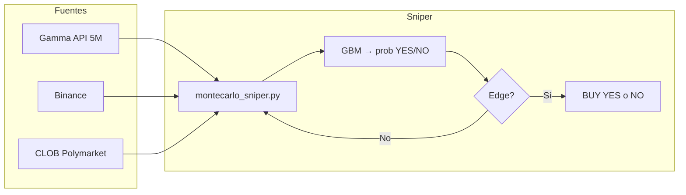
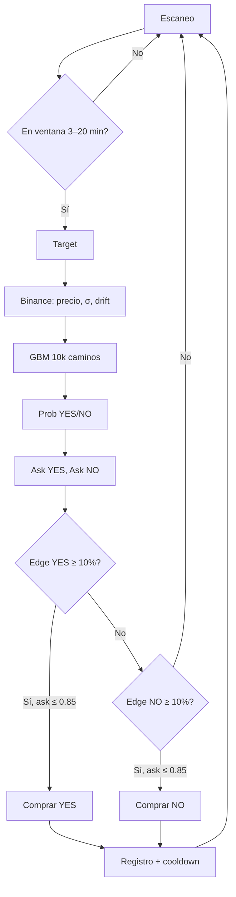

# Estrategia en producción: Monte Carlo Sniper

**Nombre oficial:** **Monte Carlo Sniper**  
**Tagline:** Motor cuantitativo basado en simulación GBM y edge vs libro (una pierna por señal).

Esta es la estrategia que **está corriendo actualmente** en la instancia para operar mercados 5M de BTC/ETH en Polymarket. El documento centraliza nombre, descripción, parámetros y referencias.

---

## 1. Nombre y descripción

| Campo | Valor |
|-------|--------|
| **Nombre** | Monte Carlo Sniper |
| **Script** | `polymarket-trading/scripts/montecarlo_sniper.py` |
| **Dashboard** | `polymarket-trading/scripts/montecarlo_cortex.py` (puerto 8050) |
| **Mercados** | Binarios 5M (tag Gamma 102892), BTC y ETH |
| **Resolución** | Precio de cierre de vela 1m de Binance (BTCUSDT/ETHUSDT) |

**En una frase:** El bot simula miles de caminos de precio (GBM) hasta la hora de cierre, obtiene una probabilidad implícita YES/NO, la compara con el ask del libro de Polymarket y, si hay **edge** suficiente, compra **una sola pierna** (YES o NO) por señal.

---

## 2. Flujo de la estrategia

1. **Escaneo** → Gamma API: eventos 5M activos que cierran en ventana configurable (p. ej. 3–20 min).
2. **Target** → `priceToBeat` del evento (o fallback: precio Binance al inicio del intervalo 5m).
3. **Datos Binance** → Precio actual, volatilidad y drift (últimas 60 velas 1m).
4. **Simulación** → Monte Carlo con GBM: N caminos de precio hasta el cierre → % de caminos por encima del target = probabilidad YES.
5. **Edge** → Si `prob_real - ask` supera un mínimo (p. ej. 10%) y el ask está por debajo de un tope (p. ej. 0.85), hay señal.
6. **Ejecución** → Una orden de compra (YES o NO) con tamaño acotado (p. ej. máx. 1 USD, máx. 2 shares).
7. **Registro** → `trades_history.json`, `traded_markets.json`, Telegram opcional. No se repite el mismo mercado.

### Diagrama: pipeline de datos

### Diagrama: lógica de decisión

### Cómo funciona en una frase

El bot solo entra cuando el **libro** (lo que paga el mercado) está por debajo de la **probabilidad que estima el modelo**: si el modelo dice 60% YES y el ask de YES está en 50¢, hay 10% de edge → compra YES. Si el modelo dice 60% NO y el ask de NO está en 48¢, hay edge en NO → compra NO. Una sola pierna por señal; tamaño fijo (1 USD, 2 shares máx) y cooldown para no repetir mercado.

---

## 3. Parámetros principales (en código / env)

| Parámetro | Descripción | Valor típico |
|-----------|-------------|--------------|
| Ventana hasta cierre | min–max segundos hasta `endDate` | 180–1200 (3–20 min) |
| Edge mínimo | Mínimo prob − ask para entrar | 0.10 (10%) |
| Ask máximo | No comprar si ask > este valor | 0.85 |
| Máx. USD por trade | Tope por operación | 1.00 USD |
| Máx. shares por trade | Tope de tamaño | 2 |
| Simulaciones GBM | Número de caminos Monte Carlo | 10 000 |
| Cooldown tras trade | Segundos antes de siguiente escaneo | 30 |
| Lock file | Una sola instancia en ejecución | `.sniper.lock` |

La wallet y las API keys se cargan desde `~/.openclaw/.env` (o la ruta configurada en el script).

---

## 4. Salidas y auditoría

- **Historial de trades:** `~/trades_history.json` (timestamp, market_id, side, price, investment, shares, resolución posterior con `resolved`, `won`, `pnl`).
- **Mercados ya operados:** `~/.openclaw/workspace/skills/polymarket/traded_markets.json` (evitar doble orden).
- **Logs:** salida estándar del proceso (o archivo si se usa systemd).
- **Telegram:** notificaciones opcionales vía `TELEGRAM_BOT_TOKEN` y `TELEGRAM_CHAT_ID`.

---

## 5. Documentación relacionada

| Documento | Contenido |
|------------|-----------|
| [VIABILIDAD_ESTRATEGIA_MONTECARLO.md](VIABILIDAD_ESTRATEGIA_MONTECARLO.md) | Análisis de viabilidad: alineación con Binance, fortalezas/debilidades del GBM, edge y riesgos. |
| [README.md](../README.md) | Quick start, configuración API, descripción general del repo. |
| [docs/README.md](README.md) | Índice de toda la documentación e investigación. |

---

## 6. Otras estrategias del proyecto

- **Double-cheap straddle:** comprar YES y NO cuando ambos asks están por debajo de un umbral; actualmente **simulada y documentada**, bot en repo pero **pendiente de wallet** para producción. Ver [SIMULACION_DOUBLE_CHEAP_STRADDLE.md](SIMULACION_DOUBLE_CHEAP_STRADDLE.md).
